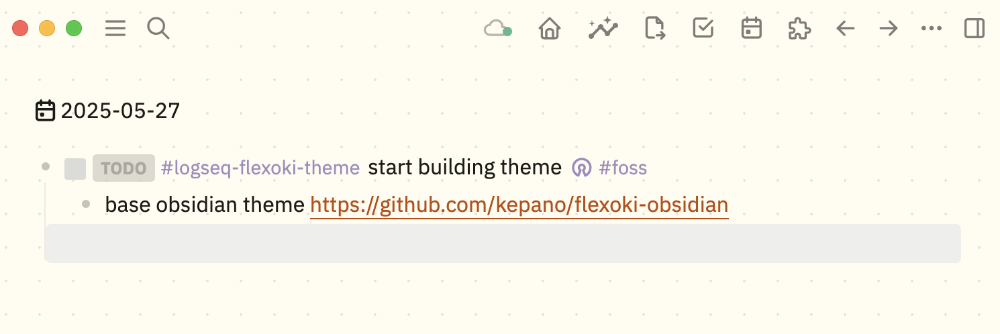

# Logseq Flexoki Theme

A beautiful, warm theme for Logseq inspired by Steph Ango's [Flexoki color scheme](https://stephango.com/flexoki). This theme brings the harmonious, paper-like aesthetic of Flexoki to your Logseq workspace.

## Features

- 🎨 **Flexoki Color Palette**: Warm, paper-inspired colors that are easy on the eyes
- 🌙 **Dark & Light Mode**: Full support for both light and dark themes
- 📝 **Typography**: Clean IBM Plex Sans font for excellent readability
- 🎯 **Semantic Colors**: Thoughtful color choices for links, highlights, and UI elements
- 📱 **Responsive**: Works great on desktop and mobile
- ⚡ **Performance**: Optimized CSS with minimal animations

## Color Palette

### Light Mode
- **Base Colors**: Warm cream and beige tones
- **Text**: Rich dark brown for excellent contrast
- **Accents**: Muted but vibrant colors for links and highlights

### Dark Mode
- **Base Colors**: Deep, warm grays and browns
- **Text**: Soft cream for comfortable reading
- **Accents**: Brighter versions of the accent colors

## Installation

### Method 1: Marketplace (Recommended)
1. Open Logseq
2. Go to Settings → Features → Themes
3. Click on "Marketplace"
4. Search for "Flexoki Theme"
5. Click "Install"
6. Select the theme from the dropdown

### Method 2: Manual Installation
1. Download or clone this repository
2. Copy the entire `logseq-flexoki-theme` folder to your Logseq's plugins directory:
   - **Windows**: `%APPDATA%\Logseq\plugins\`
   - **macOS**: `~/Library/Application Support/Logseq/plugins/`
   - **Linux**: `~/.config/Logseq/plugins/`
3. Restart Logseq
4. Go to Settings → Features → Themes
5. Select "Flexoki Theme" from the dropdown

### Method 3: Custom CSS (Alternative)
1. Copy the contents of `flexoki-theme.css`
2. In Logseq, go to Settings → General → Custom theme
3. Paste the CSS code
4. Click "Re-index" or restart Logseq

## Customization

The theme uses CSS custom properties (variables) for easy customization. All colors are defined at the top of the file:

```css
/* Light Theme Colors */
html[data-theme=light] {
    --flexoki-red: #AF3029;
    --flexoki-orange: #BC5215;
    --flexoki-yellow: #AD8301;
    /* ... more colors */
}
```

You can modify these values to create your own variation of the theme.

## Supported Features

- ✅ **Dual Mode Support**: Automatic light and dark mode switching
- ✅ **Block System**: References, embeds, and nested blocks
- ✅ **Linking**: Page references, tags, and external links
- ✅ **Code Highlighting**: Syntax highlighting for multiple languages
- ✅ **Rich Content**: Tables, lists, quotes, and media
- ✅ **Navigation**: Left and right sidebars with custom styling
- ✅ **Search**: Enhanced search interface with Flexoki colors
- ✅ **Metadata**: Properties, page metadata, and frontmatter
- ✅ **Task Management**: TODO states, priorities, and markers
- ✅ **Interactive Elements**: Buttons, forms, and controls
- ✅ **Typography**: Optimized text hierarchy and spacing

## Screenshots



## File Structure

```
logseq-flexoki-theme/
├── flexoki-theme.css    # Main theme file
├── package.json         # Logseq theme manifest
├── icon.svg            # Theme icon
├── README.md           # Documentation
├── LICENSE             # MIT license
└── colors.md          # Color palette reference
```

## Contributing

Contributions are welcome! Please feel free to:
- Report bugs or issues
- Suggest new features
- Submit pull requests
- Share feedback

## Credits

- **Color Scheme**: [Flexoki](https://stephango.com/flexoki) by Steph Ango
- **Base Structure**: Inspired by the [BUJO theme](https://github.com/stdword/logseq-bujo-theme) architecture
- **Font**: IBM Plex Sans
- **Logseq**: Built for the amazing [Logseq](https://logseq.com/) knowledge management tool

## License

MIT License - feel free to modify and share!

---

*Enjoy a more harmonious note-taking experience with Flexoki colors in Logseq!*
